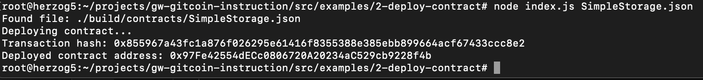

## 1. A screenshot of the console output immediately after you have successfully deployed a smart contract.

## 2. The transaction hash from the contract deployment (in text format).
0x855967a43fc1a876f026295e61416f8355388e385ebb899664acf67433ccc8e2
## 3. The deployed contract address from the contract deployment (in text format).
0x97Fe42554dECc0806720A20234aC529cb9228f4b
