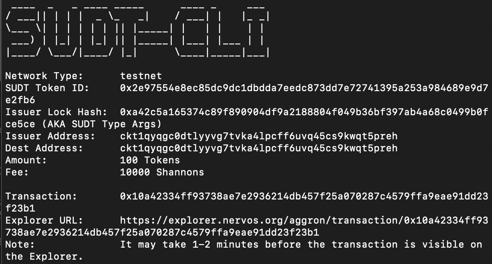
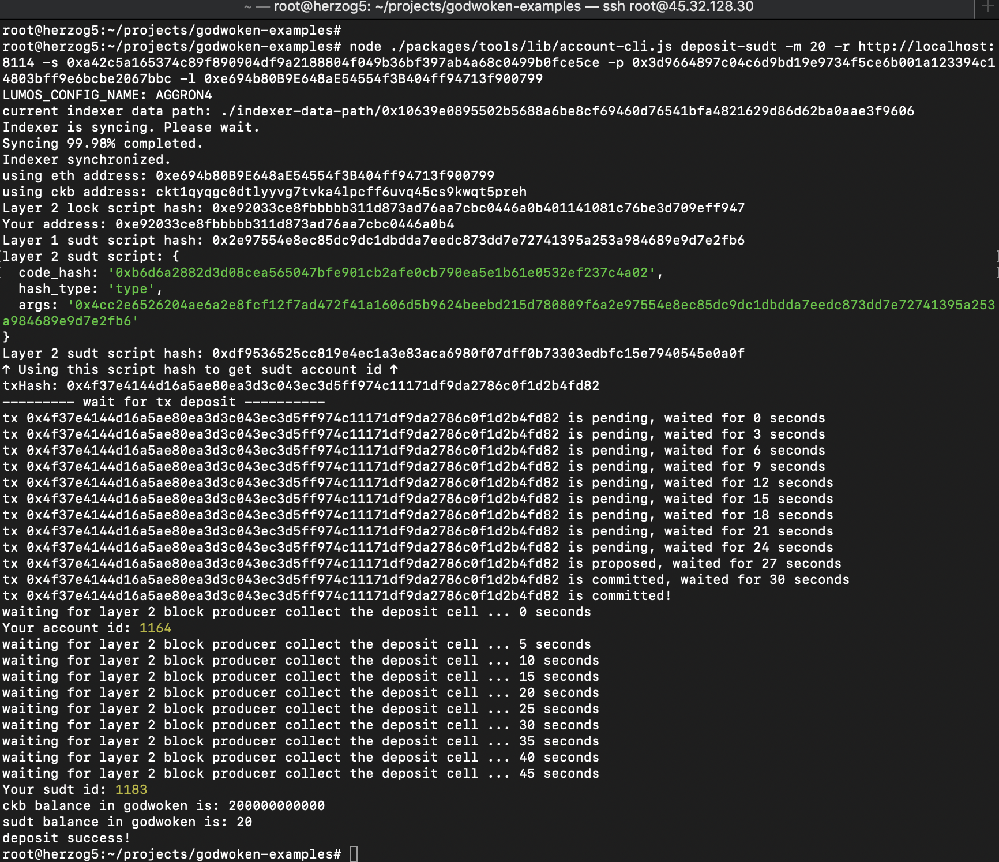

## 1. A link to the Layer 1 address you funded on the Testnet Explorer.
[https://explorer.nervos.org/aggron/address/ckt1qyqgc0dtlyyvg7tvka4lpcff6uvq45cs9kwqt5preh](https://explorer.nervos.org/aggron/address/ckt1qyqgc0dtlyyvg7tvka4lpcff6uvq45cs9kwqt5preh)
## 2. A screenshot of the console output immediately after using sudt-cli to create your SUDT tokens on Layer 1.

## 3. A link to the transaction ID created by sudt-cli on the Testnet Explorer.
[https://explorer.nervos.org/aggron/transaction/0x10a42334ff93738ae7e2936214db457f25a070287c4579ffa9eae91dd23f23b1](https://explorer.nervos.org/aggron/transaction/0x10a42334ff93738ae7e2936214db457f25a070287c4579ffa9eae91dd23f23b1)
## 4. A screenshot of the console output immediately after you have successfully submitted a deposit to Layer 2 using the account-cli tool.

## 5. The SUDT ID from the console output after executing the deposit script (in text format).
1183
