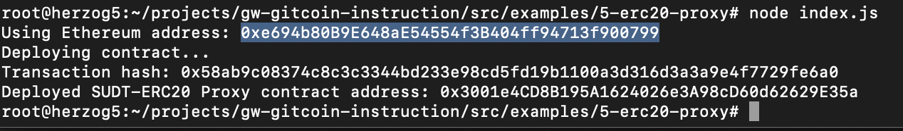
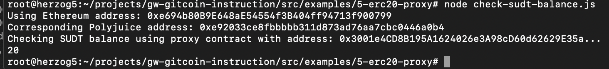

## 1. A screenshot of the console output immediately after deploying smart contract.

## 2. The address of the ERC20 Proxy Contract you deployed (in text format).
0x3001e4CD8B195A1624026e3A98cD60d62629E35a
## 3. A screenshot of the console output immediately after checking your SUDT balance.

## 4. The Ethereum address that was checked (in text format).
0xe694b80B9E648aE54554f3B404ff94713f900799
