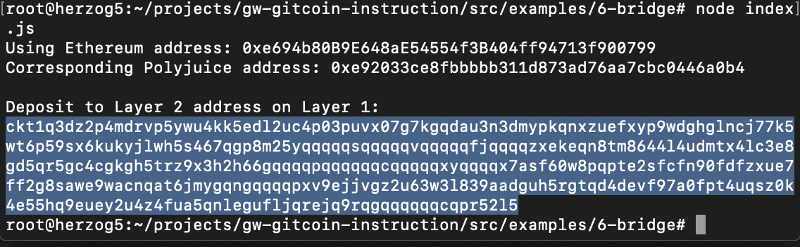

## 1. A screenshot of the console output immediately after you have successfully generated your Deposit Receiver Address.

## 2. Your Deposit Receiver Address (in text format).
ckt1q3dz2p4mdrvp5ywu4kk5edl2uc4p03puvx07g7kgqdau3n3dmypkqnxzuefxyp9wdghglncj77k5wt6p59sx6kukyjlwh5s467qgp8m25yqqqqqsqqqqqvqqqqqfjqqqqzxekeqn8tm8644l4udmtx4lc3e8gd5qr5gc4cgkgh5trz9x3h2h66gqqqqpqqqqqqcqqqqqxyqqqqx7asf60w8pqpte2sfcfn90fdfzxue7ff2g8sawe9wacnqat6jmygqngqqqqpxv9ejjvgz2u63w3l839aadguh5rgtqd4devf97a0fpt4uqsz0k4e55hq9euey2u4z4fua5qnlegufljqrejq9rqgqqqqqqcqpr52l5
## 3. The Ethereum address used to generate the Deposit Receiver Address (in text format).
0xe694b80B9E648aE54554f3B404ff94713f900799
## 4. A link to the Etherscan explorer for the successful Force Bridge transaction. This can be found on Force Bridge under History→Succeed.
[https://rinkeby.etherscan.io/tx/0x3e79cd284a7c39649f4c9b9bbf64e94e36ec03823291dd544046cca78cf0c540](https://rinkeby.etherscan.io/tx/0x3e79cd284a7c39649f4c9b9bbf64e94e36ec03823291dd544046cca78cf0c540)
## 5. A link to the Nervos explorer for the successful Force bridge transaction. This can be found on Force Bridge under History→Succeed.
[https://explorer.nervos.org/aggron/transaction/0xeb8eba8b060df5c9759985462b50996066c93b5912c034678b21401b779cac87](https://explorer.nervos.org/aggron/transaction/0xeb8eba8b060df5c9759985462b50996066c93b5912c034678b21401b779cac87)
